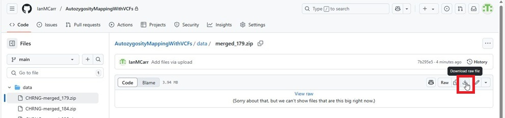
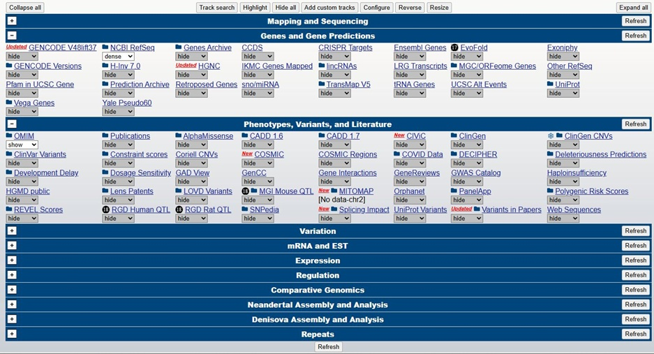
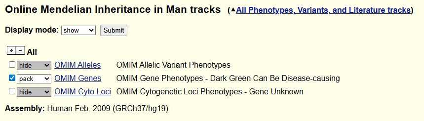
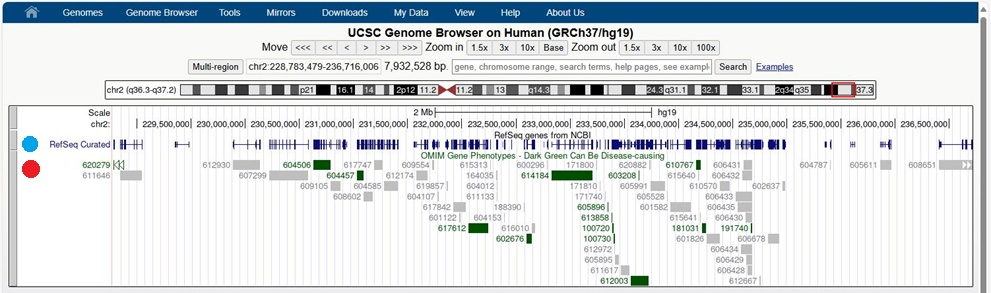
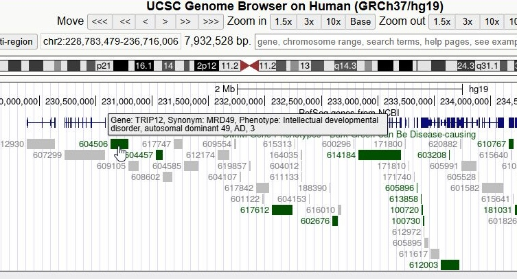

# Autozygosity mapping using exome variant data and AutozygosityMapper

There are many ways by which a disease gene can be mapped in a set of people who are affected by the same genetic condition. Of these, autozygosity mapping is one of the simplest methods that requires a small number of patients; however, the parents of the patients must be consanguineous. While microarray SNP genotype data is the gold standard for autozygosity mapping, many groups initially try to map the disease gene using the less reliable whole exome or genome variant data. This is because no matter how the patients are mapped, whole exome or genome variant data is needed to detect the specific deleterious variant, and so by using the NGS variant data, it may be possible to save money by not generating microarray SNP genotype data.

A number of command line, desktop and web applications have been developed for the detection of autozygous regions in inbred individuals ([see here](OtherPrograms.md)). For this tutorial, we will use [___AutozygosityMapper___](https://teufelsberg.charite.de/AutozygosityMapper/human/index.html). This application was chosen because it is a website; consequently, you don't have to worry about security or compatibility issues when trying to run a program on your computer. However, this doesn't mean it is the best, just more convenient for this overview. 

## Getting the data files

The [data folder](data/) contains a series of zipped VCF files, each of which contains data for a number of related people: two affected and three unaffected. Each file has had the positions of variants slightly adjusted, resulting in minor differences in the analysis outcomes between the files.  

Download the file you have been allotted by clicking on it and then selecting the download option in the upper right corner of the webpage (red box, Figure 1).

Figure 1: Download the data by clicking on the __Tray__ icon.

## AutozygosityMapper

AutozygosityMapper is here: https://teufelsberg.charite.de/AutozygosityMapper/human/index.html (Figure 2).

Figure 2: The AutozygosityMapper landing page.

If you plan to do a lot of autozygosity mapping, you can create a profile, but today just upload the data as a guest by clicking the __Create new project__ link (green box, Figure 2).

<b>Make sure the current species is set to _Human_</b> and then click on the __create new project__ link (Figure 2).

## Uploading data

 - On the __Upload genotypes__ page, enter a suitable project name in the first text area (green box, Figure 3) This name as to be unique so include a unique to you Id such as your initials.
 - Make sure the __VCF file__ option is selected (blue box, Figure 3).
 - Click on the __Choose VCF file__ button and select the merged data VCF file you downloaded earlier (red box, Figure 3).
 - Enter the genome build used when calling the variant data (black box, Figure 3).
- Press the __Submit__ button  (brown box, Figure 3)  

Figure 3: The AutozygosityMapper landing page.

When the __Submit__ button is pressed, the data file is uploaded and entered into a database. During this process the webpage displays text asking you not to try reloading the data, as the upload may take a while (Figure 4).

Figure 4: Page displayed while uploading the data.

Once the data has been uploaded and added to the database, the webpage changes to show the text in Figure 5. Saving the first link (blue box, Figure 5) will allow you to come back to the analysis at a later date; however, the data is only retained for 2 days.

Clicking on the second link (red box, Figure 5) will take you to the analysis page.

Figure 5: Page displayed once data has been uploaded.

## Processing the data

On the __(Re)analyse your genotypes__ page:  

- Make sure your current project is listed in the first text area (black box, Figure 6).
- Enter the name of the analysis in the second text area (blue box, Figure 6)
- The names of the affected patients in the fourth text area (green box, Figure 6). In this case the patients are JT710 and JT709.
- The names of the unaffected patients in the fifth text area (yellow box, Figure 6). In this case the unaffected relatives are JT706, JT707 and JT708.
- Press the __Submit__ button (pink box, Figure 6).

Figure 6: The data analysis page.

As the data is analysed, the webpage quickly displays two sets of text before displaying the final __Analysis is done__ announcement (Figure 7). This page contains three URL links: the first link directs to a permanent link valid for two days (black box Fig. 7), the second link allows users to delete the data, and the third link is for showing results (red box Fig. 7).

Figure 7: The Show results page.

## Viewing the results

The results page displays a graph of the genome going from chromosome 1 to the left and chromosome 22 to the right. Homozygous regions are shown as red (important) or black (unimportant) vertical bars. The height of the bar correlates to the length of the region and the number of variants in it (Figure 8). 

Figure 8: Graph of autozygous regions on the Show results page.

Scrolling down the page reveals a pair of tables; as all individuals in this analysis are related, the two tables are identical (Figure 9). The right-hand columns consist of links that zoom in on the variant data in the related region (discussed below).

Figure 9: Table of autozygous regions on the __Show results__ page.

At the bottom of the page are a set of links that allow the regions to be interrogated by other, linked webpages as well as a summary of the parameters used in the analysis (Figure 10).

Figure 10: Links to other websites plus the parameters used in the analysis.

### Position of variants in the region

Clicking on the __Region__ link in the first row of the __Broad__ table loads an image showing the position of variants across the region (Figure 11).

<b>Use the browser's back button to return to the results page.</b>

Figure 11: The location of the variants in a specific autozygous region.

## Genotypes of variants in the region

Clicking on the __Genotypes__ link in the first row of the __Broad__ table loads an image showing the genotypes of variants across the region (Figure 12).

<b>Use the browser's back button to return to the results page.</b>

Figure 12: The genotypes of the variants in a specific autozygous region. Red and pink variants are homozygous, and blue variants are heterozygous.

## Determining what are genes in the region with the UCSC Gnome Browser

### Selecting a region

The regions in the tables (Figure 8) are ordered by score, with the first looking like this:

|score|chr|from (bp)|to (bp)|length (bp)|
|-|-|-|-|-|	
|1200|2|228783179|236715706|7932528|

This indicates the largest region is on chromosome 2 and runs from 228,783,179 to 236,715,706. When inputting the region into other programs and/or webpages, it may be written as chr2:228783179-236715706.

### Setting up the UCSC Genome Browser

To look at the genes in this region, open the [UCSC genome browser](https://genome.ucsc.edu/) and click on the __Genomes__ item in the menu that run across the top of the page (just below the Santa Cruz logo) and select __Human GRCH37/hg19__. This may take you to a page asking which mirror you want to use – select the top link, then select __Human GRCH37/hg19__ again. This will then display a part of the genome (reloads the options used when you last viewed this site), below which are a number of options by which the display can be modified. All the active options are shown as white dropdown list boxes, while the hidden options are shown as grey dropdown lists. Select all the currently active options and set them to __hide__. Then select the __NCBI RefSeq__ option (in __Gene and Gene Predictions__) to __dense__ and the __OMIM__ option (in __Phenotypes, Variants, and Literature__) to __show__ (Figure 13a). 

If the OMIM option is greyed out click on the OMIM link above the dropdown list and select the he __Pack__ option for OMIM Genes (Figure 13b), before returning to the genome view page and pressing refresh.

Figure 13a: The option selection for the Genome Browser.

Figure 13b: If the OMIM option is greyed out, click on the OMIM link above the box and select the __Pack__ option for OMIM Genes.

### Entering the region

Near the top of the webpage is a single-line text area; enter your region's coordinates in this text area and press the __Search__ button to the right. This should generate an image similar to Figure 14.

Figure 14: The visualisation of the genes in the largest region

The view consists of two data tracks:
- The first (blue circle, Figure 14) shows the gene (transcripts) in the region. The vertical lines indicate transcribed sequences (exons), with the taller bars highlighting protein-coding sequences. The horizontal lines delimit the extent of each gene (transcript). 
- The second data tract (red circle, Figure 14) shows the genes referenced in the OMIM data set. [OMIN - "Online Mendelian Inheritance in Man"](https://www.omim.org/) is a manually annotated list of known disease genes and loci in man. Each gene is displayed as a rectangle next to the gene's OMIM ID number. In this view, known disease genes are drawn in green, while genes not linked to a phenotype are grey. Hovering the mouse cursor over a green rectangle displays a brief description of the gene's OMIM entry (Fig. 15). By selecting each OMIM gene in turn, it's possible to rapidly determine if a gene in the region is linked to the patient's phenotype.

Figure 15: Placing the cursor over an OMIM gene displays a summary of the gene with linked phenotype/disease.

