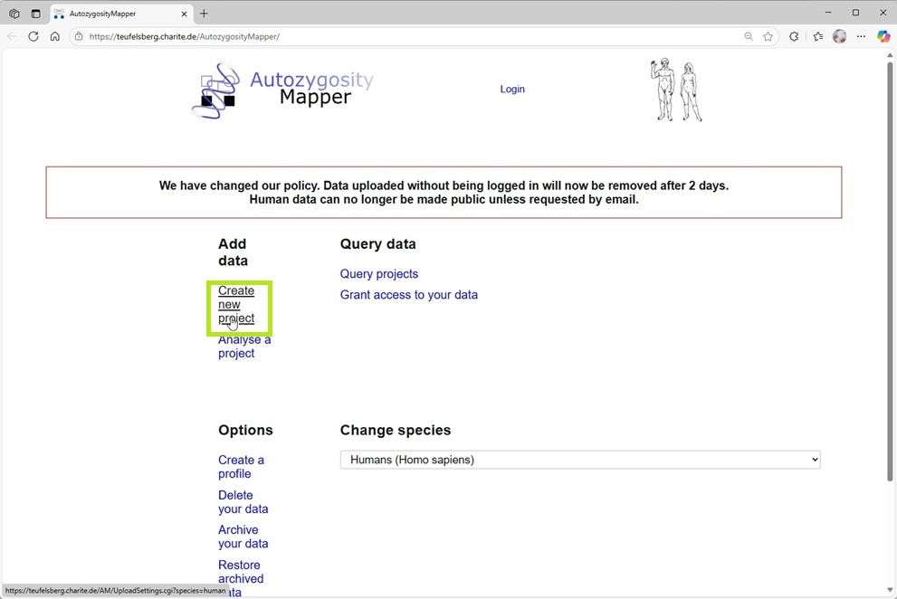

# Autozygosity mapping using exome variant data and AutozygosityMapper

There are many ways by which a disease gene can be mapped in set of people who are affected by the same genetic condition. Of these autozygosity mapping is one of the simplest methods that requires a small number of patients; however, the parents of the patients must be consanguineous. While microarray SNP genotype data is the gold standard for autozygosity mapping, many groups initially try to map the disease gene using the less reliable whole exome or genome variant data. This is because no matter how the patients are mapped, whole exome or genome variant data is need to detect the specific deleterious variant and so by using the NGS variant data it map be possible to save money by not generating microarray SNP genotype data.

A number of command line, desktop or web applications have been developed for the detection of autozygous regions in inbred individuals ([see here](OtherPrograms.md)). For this tutorial, we will use [___AutozygosityMapper___](https://teufelsberg.charite.de/AutozygosityMapper/human/index.html). The main reason this application was chosen is because it is a web site, consequently, you don't have to worry about security or compatibility issues when trying to run a program on your computer, however, this doesn't mean its is the best, just more convenient for this overview. 

## Getting the data files

The [data folder](data/) contains a series of VCF files each of which contains data for a number of related people: two affected and 3 unaffected. Each file has had the positions of variants moved a little so the results of the analysis differ slightly between each file. 

Download the file you have been alloted by clicking on it and then selecting the download option in the upper right corner of the webpage (Figure 1)

Figure 1 Download the data by clicking on the __Tray__ icon.

## AutozygosityMapper

AutozygosityMapper is here: https://teufelsberg.charite.de/AutozygosityMapper/human/index.html (Figure 1)

Figure 2 The AutozygosityMapper landing page.

If you plan to do a lot of autozygosity mapping you can create a profile, but today just upload the data as a guest.

<b>Make sure the current species is set to Human</b> and then click on the ___create new project___ link (Figure 2).

## Uploading data

 - On the __Upload genotypes__ page enter a project suitable name in the first text area (green box - Fig 3).
 - Make sure the __VCF file__ option is selected (blue box - Fig 3).
 - Click on the __Choose VCF file__ button and select the merged data VCF file you downloaded earlier (red box - Fig 3).
 - Enter the genome build used when calling the variant data (black box - Fig 3).
- Press the __Submit__ button  (brown box - Fig 3)  

Figure 3:The AutozygosityMapper landing page.

When the __Submit__ button is pressed the data file is uploaded and the data entered in to a database. During this process the webpage displays text asking you not to try reloading the data as the upload may take a while (Figure 4).

Figure 4:Page displayed while uploading the data.

Once the data has been uploaded and added to the database, the webpage changes to show the text in Figure 5. Saving the first link (blue box Fig 5) will allow you to come back to the analysis at a later time, however, the data is only retained for 2 days.

Clicking on the second link (red box Figure 5) will take you to the analysis page.

Figure 5: Page displayed once data has been uploaded.

## Processing the data

On the __(Re)analyse your genotypes__ page:  

- Make sure your current project is listed in the first text area (black box Fig 6).
- Enter the name of the analysis in the second text area (blue box Fig. 6)
- The names of the affect patients in the fourth text area (green box Fig. 6).
- The names of the unaffect patients in the fifth text area (yellow box Fig. 6).
- Press the __Submit__ button (pink box Fig. 6).

Figure 6: The data analysis page.

As the data is analysed, the webpage quickly displays two sets of text before displaying the final __Analysis is done__ page (Figure 7). This page consist of 3 URL links, the first links to a permanent (2 days) link to the day (black box Fig. 7), a link to delete the data and the Show Results link (red box Fig. 7).

Figure 7: The Show results page.

## Viewing the results

The results page displays a graph of the genome with chromosome 1 to the left and chromosome 22 to the right. Homozygous regions are shown as red (important) or black (unimportant) vertical bars. The height of the bar correlates to the length of the region and number of variants in it (Figure 8). 

Figure 8: Graph of autozygous regions on the Show results page.

Scrolling down the page reveals a pair of tables, as all individuals in this analysis are related the two tables are identical (Figure 9). The right hand columns consist of links that zoom in on the variant data in the related region (discussed below).

Figure 9: Table of autozygous regions on the Show results page.

At the bottom of the page are a set of links that allow the regions to be interrogated by other linked webpages as well as a summary of the parameters used in the analysis (Figure 10).

Figure 10: Links to other websites plus the parameters used in the analysis.

### Position of variants in the region

Clicking on the __Region__ link in the first row of the __Broad__ table loads an image showing the position of variants across the region (Figure 11).

<b>Use browser back button to return to results page</b>

Figure 11: The location of the variants in a specific autozygous region.

## Genotypes of variants in the region

Clicking on the __Genotypes__ link in the first row of the __Broad__ table loads an image showing the genotypes of variants across the region (Figure 12).

<b>Use browser back button to return to results page</b>

Figure 12: The genotypes of the variants in a specific autozygous region. Red and pink variants are homozygous and blue variants are heterozygous.

